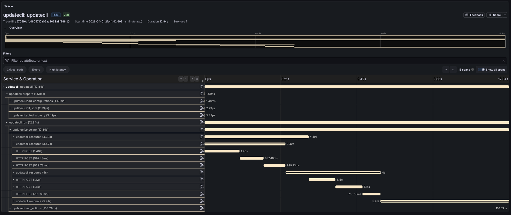

Updatecli now supports [**OpenTelemetry**](https://opentelemetry.io/) tracing. Set one environment variable and you get a full trace of every pipeline run — sources, conditions, targets, and HTTP calls to external APIs.



The trace above shows a `pipeline diff` run. You can see the prepare phase, a single pipeline with its resources, and the individual GitHub GraphQL calls. Most of the 12 seconds is network time.

## How to use it

Point `OTEL_EXPORTER_OTLP_ENDPOINT` at any OTLP-compatible backend:

```bash
OTEL_EXPORTER_OTLP_ENDPOINT=http://localhost:4317 \
  updatecli pipeline diff --config manifest.yaml
```

That's it. No flags, no config file changes. If the variable is not set, tracing is disabled and there is no overhead.

Works with Jaeger, Grafana Tempo, Datadog, Honeycomb, or any other OTLP backend. For a quick local setup:

```bash
docker run --rm -p 4317:4317 -p 16686:16686 \
  jaegertracing/all-in-one:latest
```

Then open `http://localhost:16686`.

## What you get

Each span carries attributes like pipeline name, resource kind, result status, and changed files. HTTP requests to GitHub, Docker registries, and Helm repos show up automatically with method, URL, and status code.

Errors on spans are sanitized — URL-embedded credentials get stripped before reaching the backend.

Full reference in the [**Telemetry documentation**](/docs/core/telemetry/).

## Links

- [**OpenTelemetry**](https://opentelemetry.io/)
- [**Telemetry documentation**](/docs/core/telemetry/)
- [**Jaeger**](https://www.jaegertracing.io/)
- [**Grafana Tempo**](https://grafana.com/oss/tempo/)
